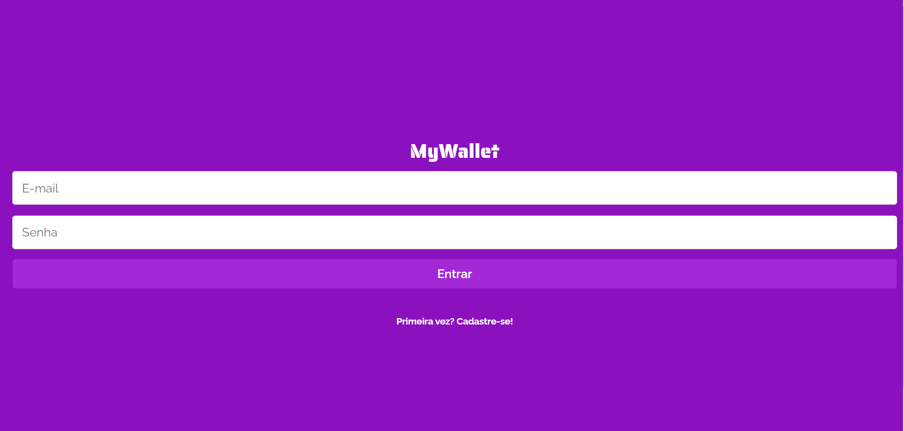
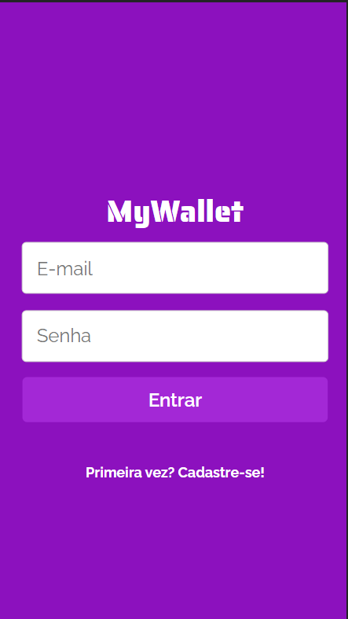

# MyWallet - React

MyWallet é um gerenciador de gastos digital para seu controle financeiro.

<div style="display: flex; gap: 10px; align-items: center">





</div>

Você pode acessar o projeto no [link](https://mywallet-tau.vercel.app/). Fique a vontade para conferiri e testar as funcionalidades.


## Sobre

MyWallet é similar a uma carteira digital, entretanto sua funcionalidade é de gerenciar gastos.

Aqui você pode:
- Criar sua conta com email e senha
- Logar em uma conta já exixtente
- Adicionar valores de entrada de dinheiro
- Adcionar valores de saída de dinheiro
- Editar valores de entrada
- Editar valores de saída
- Excluir valores de entrada
- Excluir valores de saída

O MyWallet foi criado com o intuito pessoal de gerenciar gastos sem precisar ficar recorrendo ao acesso a conta bancária sempre que quiser conferir.

Em breve:
- O usuário poderá excluir todo o histórico de uma só vez, assim podendo melhorar a performace do sistema de gerenciamento.

## Tecnologias utilizadas
  
  
  
  
  

## Como usar em desenvolvimento

- ATENÇÂO. Este projeto é o Front-End de um projeto completo. Para baixar e ver as instruções para o Back-End deste projeto [clique aqui](https://github.com/Matheus-Rodrigues-EC/MyWallet-Node) para acessar o repositório.

1. Clone o repositório
2. Instale todas as dependências

``` shell
    npm install
```
3. Configure um arquivo `.env.development` usando o `.env.example` como base.
4. Para rodar localmente use
```bash
    npm start
```

5. Para construir a aplicação use
```bash
    npm run build
```
6. Agora está pronto. Aproveite.